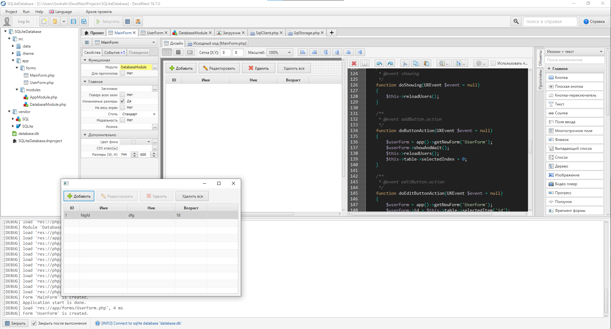

# DevelNext 16.7.0

PHP GUI

> GUI and IDE for php based on jphp, for beginners only.


---

**Dependencies**

- jphp 0.9.+ (not published yet, you can build it from the jphp sources!)
- java 1.8+ (jre)
- gradle 2.4+
- launch4j 3.8

### How to get the DevelNext IDE distrubutive?

Install JDK, clone repo and use the following console commands:
Install jppm (https://github.com/jphp-group/jphp)

```
cd /path/to/repo

jppm --tasks
jppm app:run
jppm app:build

You can find the builded distrubutive in `develnext/build/install/develnext`.

// for windows
./gradlew distIdeWindows

// for linux
./gradlew distIdeLinux
```



### License

Under MPL 2.0 (https://www.mozilla.org/MPL/2.0/)
